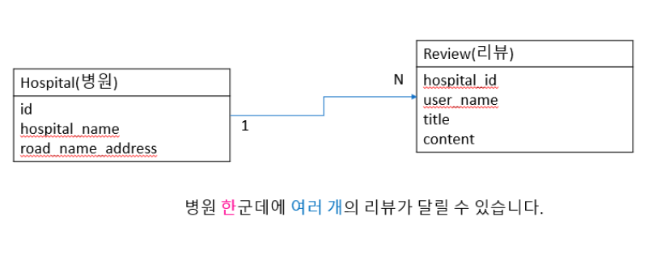
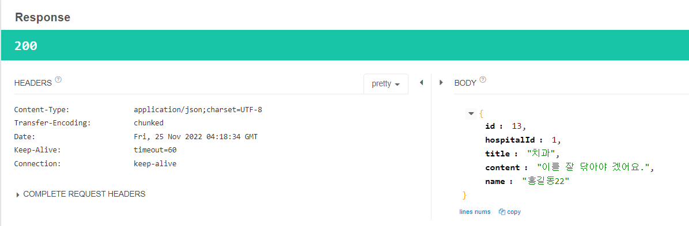
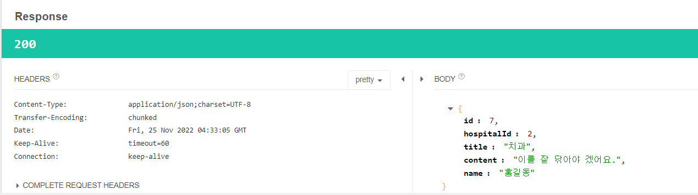
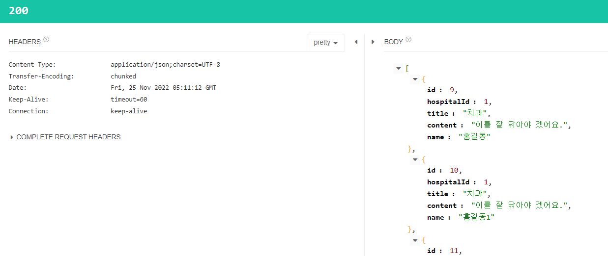
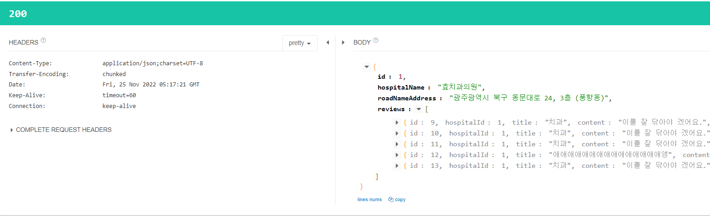

# 📢 스프링부트 핵심가이드(JPA)

## 목표

### 요구 사항

```
💡 병운에 리뷰를 달 수 있는 API를 만들자
```

### ERD



## 테이블 매핑

### Hospital과 Review 테이블 양방향 매핑

- Hospital 엔티티 코드

    ```java
    package com.jpa.study_springboot_jpa.hospital.domain.entity;
    
    import lombok.Getter;
    
    import javax.persistence.*;
    import java.util.List;
    
    @Entity
    @Table(name = "nation_wide_hospitals")
    @Getter
    public class Hospital {
        @Id
        private Integer id;
    
        private String hospitalName;
        private String roadNameAddress;
    
        @OneToMany(mappedBy = "hospital", fetch = FetchType.LAZY)
        private List<Review> reviews;
    }
    ```

- Review 엔티티 코드

    ```java
    package com.jpa.study_springboot_jpa.hospital.domain.entity;
    
    import com.fasterxml.jackson.annotation.JsonIgnore;
    import lombok.Getter;
    import lombok.NoArgsConstructor;
    
    import javax.persistence.*;
    
    @Entity
    @NoArgsConstructor
    @Getter
    public class Review {
    
        @Id
        @GeneratedValue(strategy = GenerationType.IDENTITY)
        private Integer id;
        private String title;
        private String content;
        private String name;
    
        @ManyToOne
        @JoinColumn(name = "hospital_id")
        private Hospital hospital;
    
        public Review(String title, String content, String name, Hospital hospital) {
            this.title = title;
            this.content = content;
            this.name = name;
            this.hospital = hospital;
        }
    }
    ```

- 병원 테이블 입장에서 1개에 병원에 여러개의 리뷰가 있을 수 있기 때문에 OneToMany 매핑이다.
- 리뷰 테이블 입장은 병원 입장과 반대이기 때문에 ManyToOne 매핑이다.
- `fetch = FetchType.LAZY`
    - 병원의 리뷰 정보는 많을 수 있다.
    - 병원 정보를 불러올 때마다 리뷰 정보를 불러오는 것은 비효율
    - 리뷰 데이터를 불러올 때만 Join을 한다.
    - 이것을 지연 로딩이라고 한다.

## 리뷰 등록 기능

- 병원 리뷰 등록 엔드 포인트
    - [http://localhost:8080/api/v1/hospital/1/review](http://localhost:8080/api/v1/hospital/1/review)


구현 결과

### ReviewRequest DTO 코드

```java
package com.jpa.study_springboot_jpa.hospital.domain.dto;

import com.jpa.study_springboot_jpa.hospital.domain.entity.Hospital;
import com.jpa.study_springboot_jpa.hospital.domain.entity.Review;
import lombok.Getter;

@Getter
public class ReviewRequest {
    private String title;
    private String content;
    private String name;

    public Review toEntity(Hospital hospital){
        return new Review(this.title,this.content,this.name,hospital);
    }
}
```

### ReviewResponse DTO 코드

```java
package com.jpa.study_springboot_jpa.hospital.domain.dto;

import lombok.AllArgsConstructor;
import lombok.Getter;

@AllArgsConstructor
@Getter
public class ReviewResponse {
    private Integer id;
    private Integer hospitalId;
    private String title;
    private String content;
    private String name;

    public static ReviewResponse of(Integer id, Integer hospitalId, String title, String content, String name){
        return new ReviewResponse(id,hospitalId,title,content,name);
    }
}
```

### ReviewRepository 코드

```java
package com.jpa.study_springboot_jpa.hospital.repository;

import com.jpa.study_springboot_jpa.hospital.domain.entity.Review;
import org.springframework.data.jpa.repository.JpaRepository;

public interface ReviewRepository extends JpaRepository<Review,Integer> {
}
```

### ReviewService 코드

```java
package com.jpa.study_springboot_jpa.hospital.service;

import com.jpa.study_springboot_jpa.hospital.domain.dto.ReviewRequest;
import com.jpa.study_springboot_jpa.hospital.domain.dto.ReviewResponse;
import com.jpa.study_springboot_jpa.hospital.domain.entity.Hospital;
import com.jpa.study_springboot_jpa.hospital.domain.entity.Review;
import com.jpa.study_springboot_jpa.hospital.repository.HospitalRepository;
import com.jpa.study_springboot_jpa.hospital.repository.ReviewRepository;
import lombok.RequiredArgsConstructor;
import org.springframework.stereotype.Service;

import java.util.ArrayList;
import java.util.List;
import java.util.Optional;

@Service
@RequiredArgsConstructor
public class ReviewService {

    private final ReviewRepository reviewRepository;
    private final HospitalRepository hospitalRepository;

    public ReviewResponse saveReview(Integer id, ReviewRequest reivewRequest){
        Optional<Hospital> optionalHospital = hospitalRepository.findById(id);
        if(optionalHospital.isEmpty())
            return null;
        Review review = reivewRequest.toEntity(optionalHospital.get());
        review = reviewRepository.save(review);
        return ReviewResponse.of(review.getId(),review.getHospital().getId(),review.getTitle(),review.getContent(),review.getName());
    }
}
```
## 목표

```
💡 리뷰 조회 기능을 구현해보자.
```

## 1개 리뷰 조회 기능



- 1개 병원 리뷰 조회 엔드포인트
  - [http://localhost:8080/api/v1/review/7](http://localhost:8080/api/v1/review/7)

### ReviewService 클래스에 메서드 추가

```java
public ReviewResponse getReviewPage(Integer id){
    Optional<Review> optionalReview = reviewRepository.findById(id);
    if(optionalReview.isEmpty())
        return null;
    Review review = optionalReview.get();
    return ReviewResponse.of(review.getId(),review.getHospital().getId(),review.getTitle(),review.getContent(),review.getName());
}
```

- 리뷰 id를 통해 1개의 리뷰를 가져오는 메서드
- Optional의 사용이유
  1. null을 쓰지 않기 위해 사용
  2. DB조회 할때 findById()를 쓸때 null이 나올 수 있기 때문에 사용
  3. 편의 기능을 사용하기 위해 사용

### ReviewRestController 클래스 구현

```java
package com.jpa.study_springboot_jpa.hospital.controller;

import com.jpa.study_springboot_jpa.hospital.domain.dto.ReviewResponse;
import com.jpa.study_springboot_jpa.hospital.service.ReviewService;
import lombok.RequiredArgsConstructor;
import org.springframework.http.ResponseEntity;
import org.springframework.web.bind.annotation.GetMapping;
import org.springframework.web.bind.annotation.PathVariable;
import org.springframework.web.bind.annotation.RequestMapping;
import org.springframework.web.bind.annotation.RestController;

@RestController
@RequestMapping("/api/v1/review")
@RequiredArgsConstructor
public class ReviewRestController {

    private final ReviewService reviewService;

    @GetMapping("/{id}")
    public ResponseEntity<ReviewResponse> reviewPage(@PathVariable Integer id){
        return ResponseEntity.ok().body(reviewService.getReviewPage(id));
    }
}
```

## 해당 병원의 리뷰만 조회하는 기능



- 특정 병원의 리뷰 조회 엔드 포인트
  - [http://localhost:8080/api/v1/hospital/1/review](http://localhost:8080/api/v1/hospital/1/review)

### ReviewService 클래스 메서드 추가

```java
public List<ReviewResponse> getReviewsPage(Integer id){
        Optional<Hospital> optionalHospital = hospitalRepository.findById(id);
        if(optionalHospital.isEmpty())
            return null;
        List<Review> list = optionalHospital.get().getReviews();
        List<ReviewResponse> responses = new ArrayList<>();
        for (Review review: list) {
            ReviewResponse reviewResponse = ReviewResponse.of(review.getId(),review.getHospital().getId(),review.getTitle(),review.getContent(), review.getName());
            responses.add(reviewResponse);
        }
        return responses;
    }
```

### HospitalRestController 클래스 메서드 추가

```java
@GetMapping("/{id}/review")
    public ResponseEntity<List<ReviewResponse>> hospitalReviewsPage(@PathVariable Integer id){
        return ResponseEntity.ok().body(reviewService.getReviewsPage(id));
    }
```

## 병원 정보와 리뷰 조회 기능



- 병원 정보와 리뷰 조회 기능 엔트 포인트
  - [http://localhost:8080/api/v1/hospital/1](http://localhost:8080/api/v1/hospital/1)

### HospitalResponse 클래스 구현

```java
package com.jpa.study_springboot_jpa.hospital.domain.dto;

import com.jpa.study_springboot_jpa.hospital.domain.entity.Review;
import lombok.AllArgsConstructor;
import lombok.Getter;

import java.util.List;

@AllArgsConstructor
@Getter
public class HospitalResponse {
    private Integer id;
    private String hospitalName;
    private String roadNameAddress;
    private List<ReviewResponse> reviews;
    public static HospitalResponse of(Integer id, String hospitalName, String roadNameAddress, List<ReviewResponse> reviews){
        return new HospitalResponse(id,hospitalName,roadNameAddress,reviews);
    }

}
```

### HospitalSercice 클래스 메서드 추가

```java
public HospitalResponse getHospitalPage(Integer id){
        Optional<Hospital> optionalHospital = hospitalRepository.findById(id);
        HospitalResponse hospitalResponse = null;
        if(!optionalHospital.isEmpty()){
            Hospital hospital = optionalHospital.get();
            List<Review> list = hospital.getReviews();
            List<ReviewResponse> reviews = new ArrayList<>();
            for (Review review : list) {
                ReviewResponse reviewResponse = ReviewResponse.of(review.getId(),review.getHospital().getId(),review.getTitle(),review.getContent(),review.getName());
                reviews.add(reviewResponse);
            }
            hospitalResponse = HospitalResponse.of(hospital.getId(),hospital.getHospitalName(),hospital.getRoadNameAddress(),reviews);
        }
        return hospitalResponse;
    }
```

### HospitalRestController 메서드 추가

```java
@GetMapping("/{id}")
    public ResponseEntity<HospitalResponse> hospitalPage(@PathVariable Integer id){
        return ResponseEntity.ok().body(hospitalService.getHospitalPage(id));
    }
```